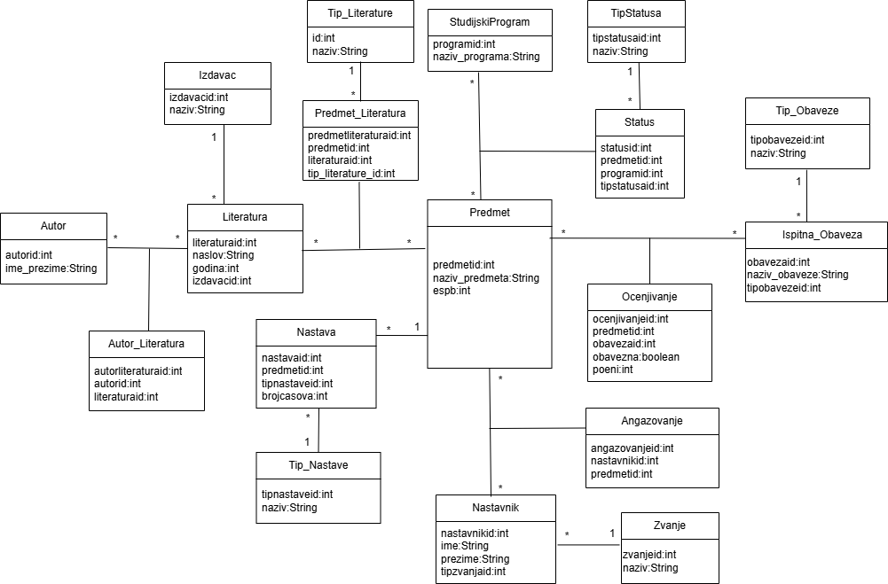

## Karton Predmeta – Spring Boot REST API

Karton Predmeta is a backend web application designed for managing university course documentation and related academic structures.
The system enables structured management of subjects, teachers, literature, grading components, workload distribution, and classification entities such as status and literature types.
This project was developed as part of university coursework and demonstrates implementation of layered architecture, relational database modeling, and REST API development using Spring Boot.

## Architecture Overview
Entity Layer - Defines domain models mapped to database tables using JPA annotations.
DTO Layer - Used for transferring structured data between layers and exposing controlled data through the API.
Controller Layer - Handles HTTP requests and exposes REST API endpoints. Receives client requests, delegates processing to the service layer, and returns structured responses.
Service Layer - Contains business logic and validation rules. Implements application-specific constraints and coordinates interaction between controllers and repositories.
Repository Layer - Responsible for database communication using Spring Data JPA. Provides CRUD operations and query mechanisms for entity persistence.
Mapper Layer - Handles conversion between Entity and DTO objects, ensuring separation between persistence models and API models.

Database versioning and schema management are handled using Liquibase.

## Class Diagram

The diagram below illustrates the relationships between core entities and their associations in the system.

## Technologies
Backend:
- Java 21
- Spring Boot 4
- Spring Data JPA
- MySQL
- Liquibase  
Frontend:
- HTML
- CSS
- JavaScript

JavaScript

REST API integration using Fetch API
